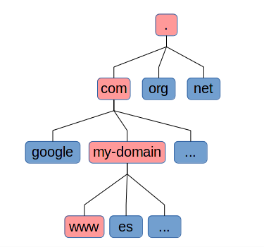
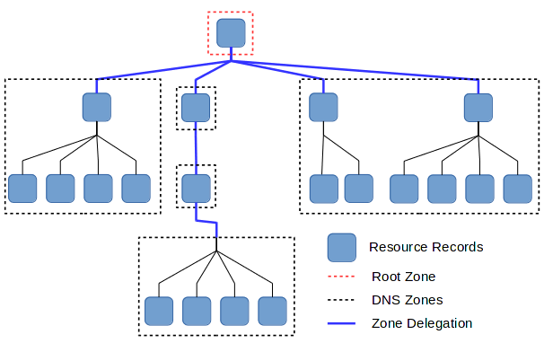
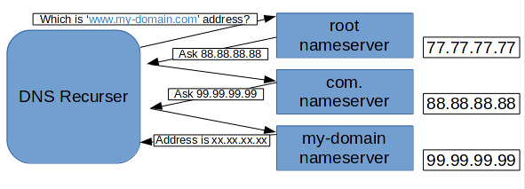

#### Describe the function of the Domain Name System (DNS) and explain how this system works.

# Understanding the Domain Name System (DNS)

Internet would be a hell for humans if we had to type IP addresses to reach a website. To solve this problem DNS comes to the rescue.

## What Is DNS?

The **Domain Name System (DNS)** is a naming system for resources connected to a network. Its main function is to translate human-friendly hostnames, such as `www.google.com`, into IP addresses like `74.125.224.72`.

## Structure

### Domain Name Syntax and Hierarchy

A domain name is composed of one or more *labels* concatenated with dots; for example `www.my-domain.com.`. Domain names ends with a dot, although it is generally omitted.

The hierarchy of domains descends from right to left. This means that, in the domain `www.my-domain.com.`, the top-level domain is `com.`, `my-domain.` is a subdomain of `com.` and `www.` is a subdomain of `my-domain.com.`.

### Domain Name Space

DNS is a hierarchical decentralized system. It has a tree structure. Each node or leaf holds information (Resource Records) about certain domain names.

The tree is sub-divided into zones beginning at the root zone. A DNS zone is managed by a name server which can manage a single domain, a combination of domains and subdomains, or delegate.

The resposibility over a zone can be delegated creating a new zone and designating it to a new name server.

### Name Servers

The name servers are the nodes of the distributed database system responsible of the maintenance of the system information. Each domain has at least one authoritative server, which is the *source of truth* in the system.

#### Authoritative Servers

Authoritative servers provide information from original sources. That is information which is not provided by another server.

## Address Resolution

When a server receives a DNS query, it searches its cached records, which have a limited lifetime. If a record matches, it answers with the corresponding IP address.

### Recursive Resolution

If no record is found in the server cache, it begins a recursive sequence of queries. This sequence begins asking for the top-level domain to the root server.

In the following diagram, the root server is queried for the domain `www.my-domain.com.`. The root server respond with a referral to a more authoritative server, which is the `com.` server. This flow goes on until the best possible answer is obtained.

## Conclusion

Domain Name System makes Internet usable, as it provides a way to use human-friendly addresses.

---

Carlos Coves Prieto

08/04/2016

Career Path 3: Modern Frontend Developer
