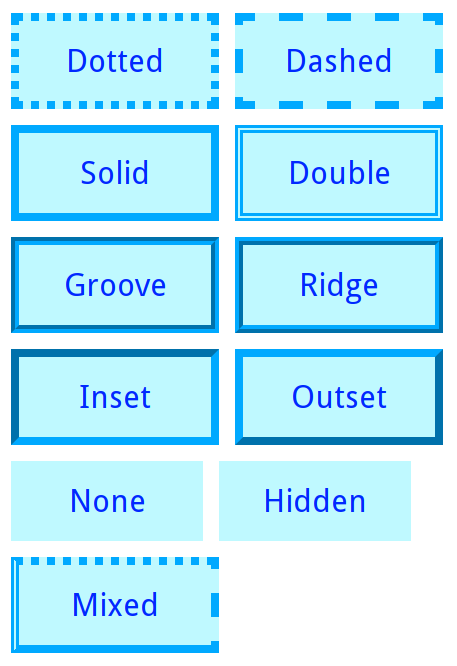
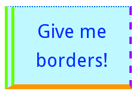

#### Explain how the `border` property and its variants `border-top`, `border-right`, `border-bottom`, and `border-left` works. Be sure to point out the values that this property takes and the effects those values can have on the display of elements.

# Adding Borders to Elements with CSS

Borders are one of the most customizable parts of an element's box model. Next we review how to specify the style of a border.

## Border Properties
Borders have three main properties, which are **style**, **width** and **color**.

### Border Style
Border style is defined by the `border-style` property. This property specifies the appearance of the border.

From [w3schools](http://www.w3schools.com/css/css_border.asp), the allowed values for this properties are the following:
- `dotted`: Defines a dotted border
- `dashed`: Defines a dashed border
- `solid`: Defines a solid border
- `double`: Defines a double border
- `groove`: Defines a 3D grooved border. The effect depends on the border-color value
- `ridge`: Defines a 3D ridged border. The effect depends on the border-color value
- `inset`: Defines a 3D inset border. The effect depends on the border-color value
- `outset`: Defines a 3D outset border. The effect depends on the border-color value
- `none`: Defines no border
- `hidden`: Defines a hidden border

And this is an example of the appereance for each value:



Note that for `none` and `hidden` values, the size of the box is affected by the absence of border. This behaviour can be modified setting the `box-sizing` property to `border-box` instead of the default `content-box`.

### Border Width
Border width is defined by the `border-width` property. This property specifies the thickness of the border.

Width can be specified as a size (in px, pt, cm, em, etc) or with pre-defined values, which are **thin**, **medium**, or **thick**.

Next image shows an example with different border thickness:


Note the slight difference in box size depending on border width. As for border style, this behaviour can be modified setting the `box-sizing` property to `border-box`.

### Border Color
Border color is defined by the `border-color` property. This property specifies the color of the border.

Border color admits *name*, *Hex*, *RGB* and *transparent* as values.

This is an example with different *Hex* values.


### Border Radius
Although border radius is not strictly a border property, it is usual to set it for creating rounded corners. It is defined by the `border-radius` property, and admits any length value. Even circular or ellipsoidal shapes can be achieved with this property.

This is a basic example, for more information visit [w3schools](http://www.w3schools.com/cssref/css3_pr_border-radius.asp):


### Additional Properties
There are more properties affecting borders, which are less used or have specific scope:

- `border-collapse`: Set the collapsing borders model for a table
- `border-spacing`: Set the border-spacing for a table
- `border-image`: Specify an image as the border around an element

## Individual Sides
Different styles, widths or colors can be specified for each element side (top, right, bottom, and left).

To set specific side styles, the following properties are availabe:
- `border-top-style`
- `border-right-style`
- `border-bottom-style`
- `border-left-style`

To set specific side widths, the following properties are availabe:
- `border-top-width`
- `border-right-width`
- `border-bottom-width`
- `border-left-width`

Finally, to set specific side colors, the following properties are availabe:
- `border-top-color`
- `border-right-color`
- `border-bottom-color`
- `border-left-color`

This is an example combining all sides and properties in a single element:



###One Line Properties
It is possible to set styles, widths or colors for each side with a single property. This is achieved with the following porperties:
- `border-style`
- `border-width`
- `border-color`

This properties support up to four values, depending on the number of values the sides affected are the following:

 - 1 value: same value for all sides
  ```css
  p {
    border-style: dotted;
  }
  
  ```
 - 2 values: top-bottom and right-left
  ```css
  p {
    border-width: 5px 10px;
  }
  
  ```
 - 3 values: top, right-left and bottom
  ```css
  p {
    border-color: #0069FF #FF00E8 #00FF16;
  }
  
  ```
 - 4 values: top, right, bottom, left
  ```css
  p {
    border-width: 2px 5px 4px 10px;
  }
  
  ```

## Shorthand
Despite the high level of customization available. It is not common to have different widths, styles or color for each element's side. The `border` property allows to set width, style and color for all sides in a single line:

```css
p {
  border: 5px solid red;
}
```

While `border-width` and `border-color` are optional, `border-style` must be specified.

##Conclusion
Border customization is a powerful tool which should be in every front-end developer arsenal. Once you master the reviewed properties, you should be able to create fancy borders for your elements.

---

Carlos Coves Prieto

04/28/2016

Career Path 3: Modern Frontend Developer
