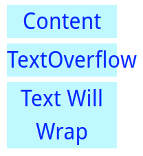
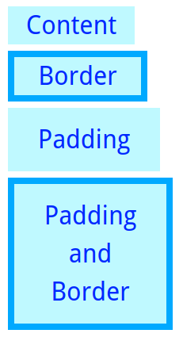
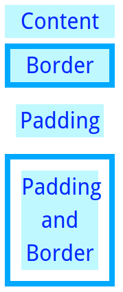

#### Explain how the width of an element is calculated, taking into account the element's content, padding, border, margin, etc.

# Calculating element's width

An element's width calculation is tightly coupled to the `box-sizing` CSS property. Depending on this property value being `content-box` (default) or `border-box`, the calculation could differs depending on element's padding or border.

## `box-sizing: content-box`
When an element's `box-sizing` is `content-box`, setting width defines the content's width. In the following example we set the width to `160px`. This fixes the content's width to `160px`. Even if the text is bigger it keeps at 160 and the text overflows or wraps.



Adding borders or padding to the element will increase the total element's width, and keeping content's width the same.



Margins put space between elements, but it doesn't affect element's width:


Given those examples, the following formulas can be deduced:
- `width = content`
- `total element's width = content + padding + borders`

## `box-sizing: border-box`
When an element's `box-sizing` is `border-box`, setting width defines the width of content, padding and border. The element's total width is fixed. Even after adding borders or paddings the element doesn't grow. Instead it will reduce the content to keep the element's width the same.

The following images shows this content reduction:



Margins behaviour keeps the same.

Thus, in this mode the previous deduced formulas would be:
- `width = content + padding + borders`
- `total element's width = content + padding + borders`

This mode has become so popular amongst developers that they use it in all elements by default:

```css
* {
  box-sizing: border-box;
}
```

---

Carlos Coves Prieto

05/20/2016

Career Path 3: Modern Frontend Developer
