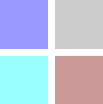
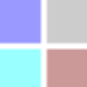

#### Describe the function of the `svg` tag and list some advantages of using SVG for client-side graphics. Provide examples.

# Vector Graphics with SVG

Scalable Vector Graphics (SVG) is a new feature in HTML5.

## Vector Graphics

According to [Wikipedia](https://en.wikipedia.org/wiki/Vector_graphics):

> Vector graphics is the use of polygons to represent images in computer graphics. Vector graphics are based on vectors, which lead through locations called control points or nodes.

### Scalable Vector Graphics (SVG)

Scalable Vector Graphics (SVG) is a standard to define vector graphics for the Web in XML format. Its specification is developed by the [World Wide Web Consortium](https://www.w3.org/) (W3C).

By scalable we mean the graphics do NOT loose quality when zoomed or resized.

Major browsers provide at least [SVG basic support](http://caniuse.com/#search=svg), while other features like effects are not consistently supported.

SVG images can be defined in standalone XML text files or embedded directly into HTML pages.

## SVG Into HTML Pages

SVG images can be defined directly into HTML pages with the `<svg>` tag. The SVG images defined with this tag have their own viewport and coordinate system.

```html
<svg width="300" height="300">
  <rect x="0" y="0" width="150" height="150" style="fill:blue"></rect>
  <rect x="150" y="0" width="150" height="150" style="fill:red"></rect>
  Your browser does not support the SVG tag.
</svg>

```

The width and height in pixels of the SVG image are defined as attributes. The `<svg>` element can contain any number of SVG elements and a fallback text for non-compatible browser. Since SVG is XML, all the elements contained in the `<svg>` tag must be written in XML. Each defined SVG element is accessible by the browser.

There are plenty of diverse elements which can be used to define the SVG image, from basic shapes such as rectangles or circles, to complex filters, elements definitions or color gradients. A detailed SVG elements list can be found in the [W3Schools SVG Reference](http://www.w3schools.com/svg/svg_reference.asp).

## SVG Advantages

### Scalable Images

As previously mentioned, SVG images do not loose quality across different devices, screen resolutions, zoom levels (in a SVG editor) or paper sizes. This is the main advantage of SVG over other image formats.

This is a enlarged fragment in a SVG image:



This is the same fragment in a `<canvas>` image:



There is a noticeable degradation.

### Accessible Elements

Every single element in a SVG image is accessible by the browser or search engines so it can be indexed or manipulated independently. The following code fills the first rectangle on the page with red color:

```js
document.querySelectorAll('rect')[0].setAttribute('style', 'fill: red')

```
#### Performance Improvement

Furthermore, an element can be redrawn without redrawing the entire image. This is not the case in a `<canvas>` element, where the entire canvas must be redrawn, and it is a significant performance improvement.

### Other Advantages

- File size depends on the image complexity, not on the size or the color depth. This leads to smaller file size.
- SVG files are XML and you only need a simple text editor to create or edit them.
- Unlike Flash, his main competitor, it is an open standard which does not rely on proprietary technology.

## Conclusion

SVG is one of the smartest new features in HTML5, bringing vector graphics native support to HTML.

---

Carlos Coves Prieto

08/19/2016

Career Path 3: Modern Frontend Developer
