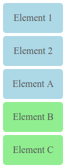

#### Describe what a "sibling selector" is. Explain how it works and give an example of its usage.

# CSS Sibling Selectors

How to select sibling elements.

## Definition
`#elementB` is sibling of `#elementA` when both have the same parent. A *sibling selector* will select all siblings of an element preceded by the element itself.

In the following example, `#elementB` is selectable as sibling of `#elementA` but not vice versa.

```html
<div id="parent">
  <div id="elementA" class="siblings">Element A</div> <!-- not selectable as sibling of elementB -->
  <div id="elementB" class="siblings">Element B</div> <!-- selectable as sibling of elementA -->
</div>

```

Elements don't need to be next to another to be selectable as siblings. If they share the same parent, only the precedence rule matters.

In the following example, `#element1` and `#element2` are not selectable as siblings of `#elementA` because it does not precede them. On the other hand, both `#elementB` and `#elementC` are selectable as siblings of `#elementA` because the are preceded by it.

```html
<div id="parent">
  <div id="element1" class="siblings">Element 1</div> <!-- not selectable as sibling of elementA -->
  <div id="element2" class="siblings">Element 2</div> <!-- not selectable as sibling of elementA -->
  <div id="elementA" class="siblings">Element A</div>
  <div id="elementB" class="siblings">Element B</div> <!-- selectable as sibling of elementA -->
  <div id="elementC" class="siblings">Element C</div> <!-- selectable as sibling of elementA -->
</div>

```

## Sibling Selector
The sibling selector symbol is `~`. To select `elementB` and `elementC` in the previous example the selector should be:

```css
#elementA ~ .siblings {
  background-color: lightgreen;
}
```

This selects all elements with the class `.siblings` preceded by `#elementA` and with the same parent. The result would be the following:



Note how `#element1`, `#element2` and `#elementA` itself are excluded from the selection because of the precedence rule.

## Conclusion
This is how siblings elements can be selected with the `element ~ element` selector.

---

Carlos Coves Prieto

05/27/2016

Career Path 3: Modern Frontend Developer
