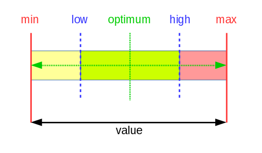
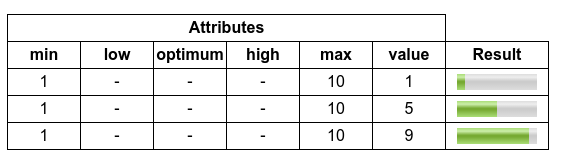
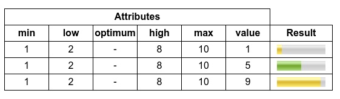
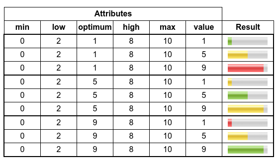
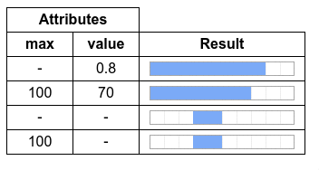

#### Describe the function of the `meter` and `progress` tags and give an example usage of each of these tags.

# Displaying Numbers and Numbers Ranges in HTML

HTML5 provides two new elements, `<meter>` and `<progress>`, to represent numbers and numbers ranges. Each one with a different purpose.

## `<meter>`
As stated in the [W3C documentation](https://www.w3.org/TR/html-markup/meter.html):

> The meter element represents a scalar gauge providing a measurement within a known range, or a fractional value.

This means the `<meter>` tag is meant to represent a scalar measurement such as an exam result, disk usage or the temperature of a cold storage unit. Note all these examples have a defined range. This is the key purpose of this element, the absence of a defined range should be a warning to not use this element. It neither should be used to represent the progress of a task. For this purpose, the `<progress>` element should be used.

### Syntax and Attributes

This element must have both a start and end tag, this allows it to provide a fallback text for browsers not supporting it. The [W3C documentation](https://www.w3.org/TR/html-markup/meter.html#meter-constraints) specifies that a meter element must not contain another meter element as a descendant.

This is a basic meter tag definition and its appearance:

```html
<meter value="0.5">Value: 0.5. Meter tag not supported by this browser</meter>

```


The `value` attribute is the only one that must be specified. But the meter tag provide specific attributes which help to define the measurement range properly:

- `min`: the minimum allowed value
- `max`: the maximum allowed value
- `low`: defines a "low" segment of the meter
- `high`: defines a "high" segment of the meter
- `optimum`: defines the "optimum" value for the meter
- `value`: the actual value of the measurement



These attributes can be used to define three different segments for the meter. The previous diagram introduces some rules and restrictions to be considered:

- `value` must in the range defined by `min` and `max`
- When not present, `min` and `max` default to `0` and `1` respectively
- `low`, `high` and `optimum` must be also in the range defined by `min` and `max`
- The "low" segment is defined by `min` and `low`
- The "high" segment is defined by `high` and `max`
- `low` must be less than or equal to `high`

Let's play only with the `value` attribute:


Now we add `low` and `high` to define a range form `0` to `10`:



Time to define "low" and "high" sections. Note the yellow color when value falls into any of those sections:



By default, the "middle" section is defined as the optimal one, thus the green color. We can change with the `optimum` attribute. If `optimum` value falls into the "low" section, that section will be considered as the optimal one, thus colored green; then the "middle" section will be colored yellow and the "high" section will be colored red.  Something similar happens when the `optimum` value falls into the "high" section, then the "middle" section will be colored yellow as before and this time the "low" section will be colored red.



## `<progress>`

As stated before, the `<progress>` element should be used to display the progress of a task. The most typicla usage of this element is to display the progress of a file upload.

## Syntax and Attributes

This element, just like `<meter>`, must have both a start and end tag, this allows it to provide a fallback text for browsers not supporting it. The [W3C documentation](https://www.w3.org/TR/html-markup/progress.html#progress-constraints) specifies that a progress element must not contain another progress element as a descendant.

This is a basic progress tag definition and its appearance:

```html
<progress value="0.5">Value: 0.5. Progress tag not supported by this browser</progress>

```


The specific attributes for this elements are:

- `max`: defines the total work required by the task
- `value`: the actual completed work for the task

None of these attributes are mandatory. `max` default to `1` when not present. The absence of the `value` attribute makes the `<progress>` element enter in an indeterminate state, where the progress bar displays a cyclic animation:



## Conclusion

The new in HTML5 `meter` and `progress` tags provide a great way to display numbers ranges and tasks progressions in a appropriate mode.

---

Carlos Coves Prieto

10/20/2016

Career Path 3: Modern Frontend Developer
