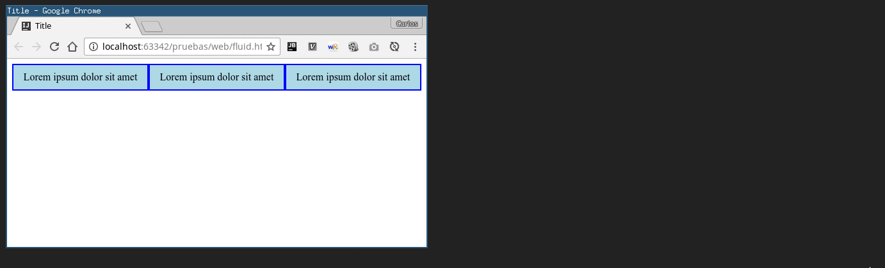
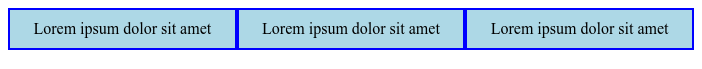
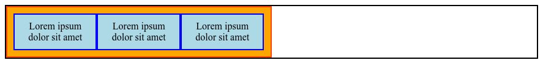
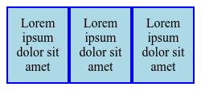
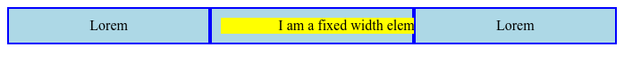

#### Use code examples and accompanying screen-shots to fully describe fluid layouts.

# Fluid Layouts

Fluid layouts, also known as liquid layouts, adapt their size to the current screen's width. This is so convenient when targeting different screen sizes because the content will automatically grow or shrink to fit in the available space, even on window resize.



This behavior is achieved by setting the content's width with percentages instead of a fixed length. Let's see some examples.

## Examples

```html
<body>
  <div class="one-third">Lorem ipsum dolor sit amet</div>
  <div class="one-third">Lorem ipsum dolor sit amet</div>
  <div class="one-third">Lorem ipsum dolor sit amet</div>
</body>

```

```css

.one-third {
  background-color: lightblue;
  border: 2px solid blue;
  box-sizing: border-box;
  float: left;
  padding: 10px;
  text-align: center;
  width: 33.33%;
}

```

In this code the width of the `divs` have been set to `33.33%`. Combined with `box-sizing: border-box;` and `float: left` this will produce a three column layout which will take all the available horizontal space on the screen.



This structure can be nested to build more complex layouts. Let's embed these columns in a container occupying half of the screen width. This is the relevant code.

```html
<body>
<div class="half">
  <div class="one-third">Lorem ipsum dolor sit amet</div>
  <div class="one-third">Lorem ipsum dolor sit amet</div>
  <div class="one-third">Lorem ipsum dolor sit amet</div>
</div>
</body>

```

```css
.half {
  background-color: orange;
  width: 50%;
}

.one-third {
  background-color: lightblue;
  float: left;
  width: 33.33%;
}

```



The black border marks the size of the body. Note how the `half` container occupy half the screen width and how the previous three columns layout fills all the available space in the `half` container.

## Pros and Cons

Fluid layouts have some clear benefits, giving developers an easy way to build adaptive layouts which adjusts elegantly to almost any display size.

Unfortunately, this way of setting widths alone can lead to some undesirable results. For example, our simple three columns layout can look too tight on smaller displays.



On the contrary, the lack of content can create an excessive empty space on large screen resolutions.


Last but not least, the presence of fixed width elements mess up the layout completely.



All these issues can be solved by applying responsive techniques involving media queries or responsive media.

## Conclusion

Fluid layouts based on percentages is a simple way to build flexible content. This technique should be applied together with some other responsive techniques to achieve optimal results in some edge cases.

---

Carlos Coves Prieto

10/17/2016

Career Path 3: Modern Frontend Developer
