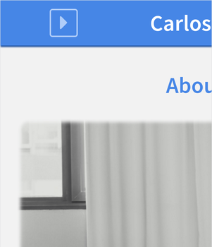

#### Explain what the viewport is and give detailed instructions about how to change the viewport settings to support responsive design.

# Working with the Browser Viewport

## Introduction

The browser viewport is the visible area used for displaying pages by browsers. The size of this area is a critical constraint on the user experience. To give developers control over the initial state of the viewport Apple created the "viewport meta tag" for Mobile Safari. This tag has been widely adopted to provide Responsive Web Design support to mobile browsers. Let's see how it works.

## The "Viewport Meta Tag"

While it is not part of any standard, `viewport` is one of the possible values for the `name` attribute of the `<META>` tag. When `viewport` is used, the `content` attribute provides information about what the initial state, commonly width and scale, of the viewport should be.

The "viewport meta tag" has no effect on desktop browsers, only on mobile ones.

The following is the `<META>` element recommended by the [W3C](http://www.w3schools.com/css/css_rwd_viewport.asp) to provide Responsive Web Design support:

```html
<meta name="viewport" content="width=device-width, initial-scale=1.0">

```

## Properties

The recognized properties in the `content` attribute are:

- `width`: initial width of the viewport
- `height`: initial height of the viewport
- `initial-scale`: initial zoom factor
- `minimum-scale`: minimum allowed zoom factor
- `maximum-scale`: maximum allowed zoom factor
- `user-scalable`: enable or disable user interaction with zoom factor

We will describe the most important values for these properties with the help of some examples.

### Examples

The example page displays different depending on the viewport width. We will check how it looks on a desktop browser first, where the "viewport meta tag" has no effect.

This is how it looks on large screen resolutions (greater than or equal to `1000px`):


On medium resolutions (between `700px` and `999px`):


On tablet resolutions (between `450px` and `699px`):


And on mobile resolutions (smaller than `450px`):


Now we will emulate a Nexus 7 tablet (600x960px). It should display on tablet resolutions. Let's see what happens if we don't have any "viewport meta tag":


This is bad. It displays on medium resolutions.

#### `width`

Let's add a width value:

```html
<meta name="viewport" content="width=600px">

```


Now better. Putting a fixed value on width forces the page to display on the selected viewport width. If we set width to `1000px` we force the browser to display the page like in a desktop viewport, the page width will overflow the screen width, forcing us to scroll horizontally.

```html
<meta name="viewport" content="width=1000px">

```


A fixed value can help us when targeting a specific resolution. But what if we want to target a wide range of resolutions? The `device-width` value comes to the rescue. This value will be translated to the actual width of the device screen, allowing the page to display correctly on all devices. This is why the W3C recommends it.

#### `initial-scale`

Another interesting property is `initial-scale`, which specifies the initial zoom factor. A value of `1.0` means no zoom. Values greater than `1.0` zoom the page in and values smaller than `1.0` zoom the page out.

```html
<meta name="viewport" content="width=device-width, initial-scale=2.0">

```



```html
<meta name="viewport" content="width=device-width, initial-scale=0.5">

```


#### `minimum-scale` and `maximum-scale`

These properties specify a limit to the zoom factor. They are commonly used to restrict the user interaction with the zoom.

#### `user-scalable`

This property is used to enable or disable the user interaction with the zoom. It is not recommended to disable it, as it can potentially cause accessibility problems.

## Conclusion

The "viewport meta tag" is an essential tool when our page needs to support mobile devices.

Hem!!! Hem!!!

OK OK. It is just an essential tool.

---

Carlos Coves Prieto

10/21/2016

Career Path 3: Modern Frontend Developer
