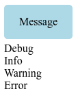
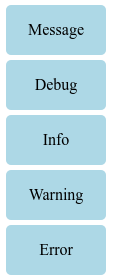
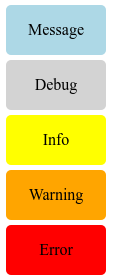
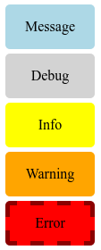

#### Explain how inheritance works in Sass and use code samples to demonstrate.

# Sass Style Inheritance

Sass can take advantage of style inheritance to make already defined styles more reusable.

## Inheritance in OOP

Inheritance in Sass is very similar to inheritance in OOP (Object Oriented Programming).

In OOP we can define a base class with its properties. This base class can be extended with sub-classes. These sub-classes inherit all the properties defined in the base class. In addition, sub-classes can define its own properties and even override properties of the base class.

Just to clarify, OOP classes are more than just a set of properties, but those concepts are not relevant for Sass.

## Inheritance in Sass

Inheritance is Sass works just like described above. Let's discuss this behavior with a simple example. Say we have defined five different types of messages for an application:

- Message
- Debug
- Info
- Warning
- Error

```html
<div class="message">Message</div>
<div class="debug">Debug</div>
<div class="info">Info</div>
<div class="warning">Warning</div>
<div class="error">Error</div>

```

There are common styles for them, including `width`, `height` and `border-radius`, among others. But they have different background colors. We have the `.message` class already defined:

```css
.message {
  background-color: lightblue;
  border-radius: 5px;
  width: 100px;
  height: 50px;
  margin-bottom: 5px;
  text-align: center;
  line-height: 50px;
}

```

This will be our **base class**, and we will extend it, taking advantage of inheritance, to create all the needed styles for our messages. For now, the appearance of the sample HTML is:



In Sass, they keyword `@extend` is used to extend the set of CSS properties from one selector to another. We are going to create all the needed classes and make them inherit from our base class:

```scss
.message {
  background-color: lightblue;
  border-radius: 5px;
  width: 100px;
  height: 50px;
  margin-bottom: 5px;
  text-align: center;
  line-height: 50px;
}

.debug {
  @extend .message;
}

.info {
  @extend .message;
}

.warning {
  @extend .message;
}

.error {
  @extend .message;
}

```

Now `.debug`, `.info`, `.warning` and  `.error` will inherit all the properties from `.message`, our base class. This compiles to the following CSS:

```css
.message, .debug, .info, .warning, .error {
  background-color: lightblue;
  border-radius: 5px;
  width: 100px;
  height: 50px;
  margin-bottom: 5px;
  text-align: center;
  line-height: 50px;
}

```

And it looks like this:



We are going to override the `background-color` property of the base class and assign a new value to each type of message:

```css
.debug {
  @extend .message;
  background-color: lightgray;
}

.info {
  @extend .message;
  background-color: yellow;
}

.warning {
  @extend .message;
  background-color: orange;
}

.error {
  @extend .message;
  background-color: red;
}

```

This compiles to:

```css
.message, .debug, .info, .warning, .error {
  background-color: lightblue;
  border-radius: 5px;
  width: 100px;
  height: 50px;
  margin-bottom: 5px;
  text-align: center;
  line-height: 50px;
}

.debug {
  background-color: lightgray;
}

.info {
  background-color: yellow;
}

.warning {
  background-color: orange;
}

.error {
  background-color: red;
}

```

And it looks like this:



Note how all the inherited properties which are not overridden remain the same. We can even define a new property, for example a border, in a sub-class:

```css
.error {
  @extend .message;
  background-color: red;
  border: 2px dashed darkred;
  line-height: 40px;
}

```



## Conclusion

Inheritance is Sass allow us to re-use styles and keep our Sass very DRY (Don't Repeat Yourself).

---

Carlos Coves Prieto

11/14/2016

Career Path 3: Modern Frontend Developer
